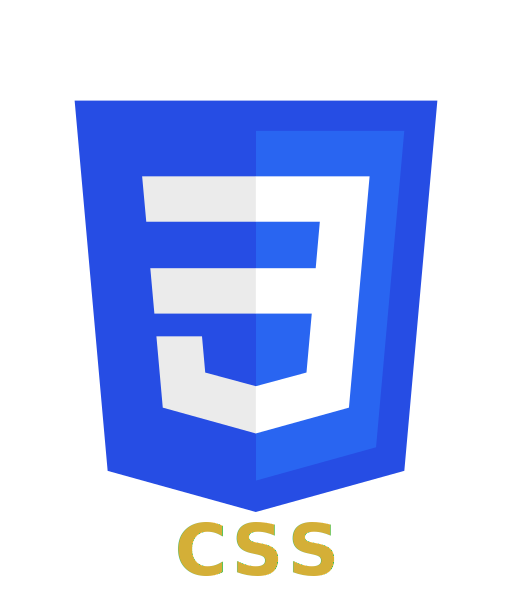
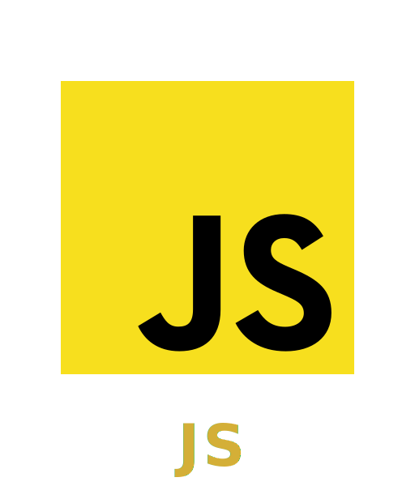
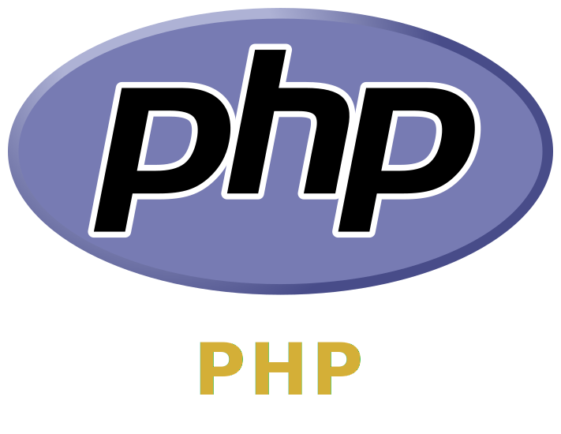

# Hola a tod@s:

# Soy Pedro Moreno

## Desarrollador Full Stack: Python, HTML, CSS, JavaScript, PHP | bash/sh | Técnico Especialista en Electrónica Industrial

Actualmente, potencio mi perfil tecnológico cursando un Máster en Desarrollo Full-Stack en Conquer Blocks, integrando habilidades de desarrollo moderno para crear soluciones web de extremo a extremo.

Cuento con 20 años de experiencia liderando y gestionando equipos como jefe de grupo en el sector retail, destacando por mi capacidad organizativa y resolución de problemas.

    

    

# 
